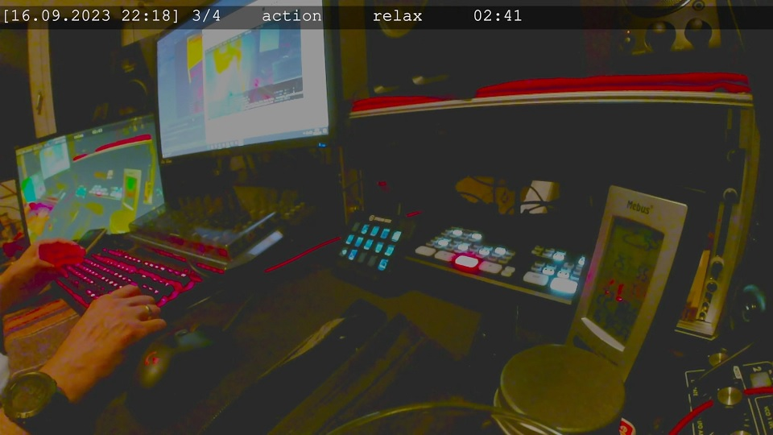

# pomodoro-logger

## Write a "pomodoro timer" into a text file
A simple command line tool to write "pomodoro timer" in a text file (log file). <br>
You can use it as a Pomodoro Timer while Streaming with OBS Studio (Open Broadcaster Software). <br>

Example output while streaming with OBS Studio:<br>



Text file is generated by using the python loggging mechanismen<br>
Attention: The logfile will grow (one entry every second) while executing this script.<br>


## Start pomodoro timer
a) download the Python Script<br>
b) start python script:<br>
```
# python pomodoro-logger.py
```

the script will automatically start to write the timer data line for line<br> 
in the file "pomodoro.log" in the same directory of the script:
```
# more pomodoro.log
[16.09.2023 21:05] start 4 pomodoro rounds (20m 5m)
...
[16.09.2023 22:31] 4/4    action      relax    08:53
[16.09.2023 22:31] 4/4 -> action <-   relax    08:52
[16.09.2023 22:31] 4/4    action      relax    08:51
[16.09.2023 22:31] 4/4 -> action <-   relax    08:50
...
```

c) stop python script with "\<ctrl\> c" <br>

You can use this log file for OBS, as a working time log or for evaluating your "action times".

## change Pomodoro Settings
You can change the number of rounds, the "action time" (minutes) and the "relax time" (minutes) 
by changing the following constants in the python script in the main() part:
```sh
pomorounds = 4          # set number of pomodoro rounds ..
pomoactiontime = 30     # set minutes to focus
pomorelaxtime = 5       # set minutes for break time
```

## OBS configuration
First execute the script a few seconds to generate the log file the first time.<br>
Start OBS an choose your "Szene" to add the pomodoro counter<br>
a) add "Text(GDI+)" to a "OBS Szene"<br>
b) activate "Aus Datei lesen"<br>
c) choose "pomodoro.log" file from you location of the python script <br>


## OBS Fine Tuning (OBS Configuration Options)
```
Schriftart: "Courier New Standard" (Size 70)
Aus Datei lesen (aktiv)
Antialiasing aktivieren (aktiv)
Farbe: "#ffffff"
Deckkraft "90%"
Hintergrundfarbe "#000000"
Hintergrunddeckkraft "70%"
Ausrichtung "Zentriert"
Vertikale Ausrichtung "Zentriert"
Kontur (aktiv)
Konturgröße "2"
Konturfarbe "#a5a5a5"
Konturdeckkraft "100%"
Chatlogmodus (aktiv)
Chatlogzeilenlimit "1"
Benutzerdefinierten Textbereich benutzen (aktiv)
Breite "3000"
Höhe "90"
Zeilenumbruch (DEAKTIV)
```